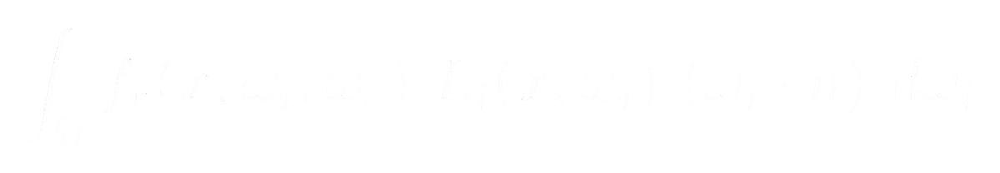

 

  <h3><b><i>Mathematics is the language with which God has written the universe</i></b></h3>

  

  <samp>
       
      <b>< Passionate Computer Scientist /></b>
  </samp>

 

<!--

-->

  

 

 

<table align="center">

  <tr>
    <td align="center" width="110">    C++ </td>
    <td align="center" width="110">    CMake </td>
    <td align="center" width="110">    Vulkan </td>
    <td align="center" width="110">    OpenGL </td>
    <td align="center" width="110">    Unity </td>
  </tr>

  <tr>
  <td align="center" width="110">    Python </td>
  <td align="center" width="110">   Keras </td>
  <td align="center" width="110">   Swift </td>
   <td align="center" width="110">   SwiftUI </td>
  <td align="center" width="110">   Metal </td>
  
  </tr>

  <tr>
    <td align="center" width="110">   Git </td>
    <td align="center" width="110">   Docker </td>
    <td align="center" width="110">    Linux </td>
    <td align="center" width="110">   Kali </td>
    <td align="center" width="110">    RaspberryPI </td>
    
  <tr>
    <td align="center" width="110">    Node.js </td>
    <td align="center" width="110">    Flask </td>
    <td align="center" width="110">    PostgreSQL </td>
    <td align="center" width="110">    MongoDB </td>
    <td align="center" width="110">    Firebase </td>
  </tr>

  <tr>
    <td align="center" width="110">    Svelte </td>
    <td align="center" width="110">    TypeScript </td>
    <td align="center" width="110">    Tailwind </td>
    <td align="center" width="110">    CSS </td>
    <td align="center" width="110">    JavaScript </td>
  </tr>
  </tr>

<!--
  <tr>
  <td align="center" width="110">    Figma </td>
  <td align="center" width="110">    Blender </td>
  <td align="center" width="110">    Ableton </td>
  <td align="center" width="110">    Premiere </td>
  <td align="center" width="110">    After Effects </td>
  </tr>
-->
</table>

 

 

<!--

  <a href="https://github.com/TheJoseph-Dev">
  

-->

 
 

 

### About me

  
  
  
  
  

